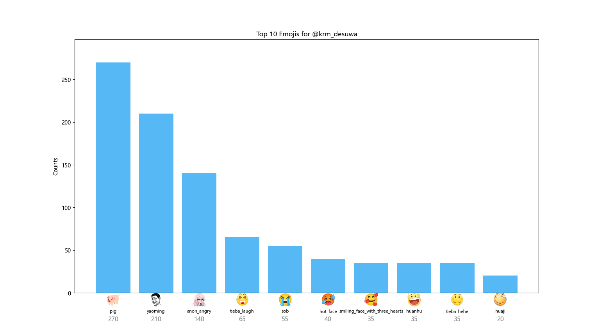

# 水源社区用户 Emoji 统计工具

一个用于统计水源社区用户发言中 emoji 使用情况的小工具。基于https://github.com/Labyrinth0419/shuiyuan_exporter 和cursor（大雾）开发

## ✨ 功能特性

- 📊 统计用户回复中的 Emoji 使用情况
- 🎯 支持 Emoji 短代码与 HTML 图片（形如 `:smiling_face_with_three_hearts:`；当前不统计原生 Unicode 表情）
- 📈 生成详细统计报告（JSON + Markdown）与 Top10 柱状图（PNG）
- 👥 支持批量分析多个用户
- 📁 按话题分类统计

## 🚀 快速开始

### 1. 安装依赖

```bash
pip install -r requirements.txt
```

### 2. 设置 Cookie

**方式一：命令行设置**
```bash
python user_emoji_stats.py --set-cookie "你的Cookie字符串"
```

**方式二：手动创建文件**
创建 `cookies.txt` 文件，粘贴你的 Cookie 内容。

**如何获取 Cookie？**
1. 打开浏览器，登录水源社区
2. 按 F12 打开开发者工具
3. 找到 Network（网络）标签
4. 刷新页面，找到任意请求
5. 找到 Cookie 字段，复制整个值

### 3. 开始使用

**分析单个用户：**
```bash
python user_emoji_stats.py <your_username>
```

**批量分析多个用户：**
```bash
python user_emoji_stats.py -b user1 user2 user3
```

**限制分析页数（快速预览）：**
```bash
python user_emoji_stats.py <your_username> -p 5
```

**按时间窗口统计（ISO8601）：**
```bash
# 统计 2024 年全年的使用情况
python user_emoji_stats.py <your_username> --since 2024-01-01T00:00:00Z --until 2024-12-31T23:59:59Z

# 也可交互输入（直接回车跳过）
python user_emoji_stats.py
```

**交互模式：**
```bash
python user_emoji_stats.py
```

**图形界面（按天选择时间窗口）：**
```bash
python user_emoji_stats.py --gui
```
在 GUI 中：
- 输入用户名
- 选择开始/结束日期（YYYY-MM-DD，可留空，内置日历选取器）
- 可选最大页数
- 点击“开始分析”，完成后“打开输出目录”查看报告与图表
 - 提供快捷按钮：最近7天 / 最近30天 / 本月 / 今年

如遇未安装 tkcalendar，将自动回退为手动输入日期；安装：
```bash
pip install tkcalendar
```

## 📊 输出示例

### 终端输出
```
==============================================================
用户 @<your_username> 的 Emoji 使用统计
==============================================================
总回复数: 1250
包含 Emoji 的回复数: 380
Emoji 使用率: 30.40%
Emoji 总数: 856
不同 Emoji 种类: 42

--------------------------------------------------------------
Top 10 最常用 Emoji:
--------------------------------------------------------------
 1. 😀                    :  156 次 (18.22%)
 2. ❤️                    :  124 次 (14.49%)
 3. 👍                    :   98 次 (11.45%)
...
==============================================================
```

### 保存的文件

文件保存在 `./emoji_stats_output/` 目录。为便于区分不同时间窗口，文件名包含窗口后缀（若选择了时间范围）：
- `{username}_emoji_stats_{YYYYMMDD}_to_{YYYYMMDD}.json` - 完整统计数据
- `{username}_emoji_report_{YYYYMMDD}_to_{YYYYMMDD}.md` - 详细报告（Markdown）
- `{username}_top10_{YYYYMMDD}_to_{YYYYMMDD}.png` - Top10 柱状图（自动嵌入 Markdown）
- `comparison_report.md` - 多用户对比（批量分析时）

## 📝 命令行参数

```
python user_emoji_stats.py [-h] [-b USER1 USER2 ...] [-p MAX_PAGES] [--set-cookie COOKIE] [username]

位置参数:
  username              要分析的用户名

可选参数:
  -h, --help            显示帮助信息
  -b, --batch USER1 USER2 ...
                        批量分析多个用户
  -p MAX_PAGES, --max-pages MAX_PAGES
                        最大分析页数（默认: 全部）
  --since SINCE         开始时间 (ISO8601, 如 2024-01-01T00:00:00Z)
  --until UNTIL         结束时间 (ISO8601, 如 2024-12-31T23:59:59Z)
  --set-cookie COOKIE   设置 Cookie
```

## 🎯 使用场景

### 场景 1：快速查看某人的 emoji 风格
```bash
python user_emoji_stats.py username -p 3
```
只看前3页（约90条回复），快速了解

### 场景 2：完整分析自己的 emoji 习惯
```bash
python user_emoji_stats.py your_username
```
分析所有回复

### 场景 3：对比多个用户
```bash
python user_emoji_stats.py -b alice bob charlie
```
生成对比报告

## 📁 项目结构

```
emoji_stats/
├── user_emoji_stats.py   # 主程序
├── http_utils.py          # HTTP 请求工具
├── config.py              # 配置文件
├── requirements.txt       # 依赖列表
├── README.md              # 本文档
├── cookies.txt            # Cookie 文件（需创建）
└── emoji_stats_output/    # 输出目录（自动创建）
```

## 🔧 技术实现

### 支持的 Emoji 格式

1. **Discourse 短代码**（当前主要统计对象）
   - 示例：`:smile:` `:heart:` `:+1:`
   - 识别：正则匹配 `:name:` 格式，仅允许小写字母与下划线

2. **HTML 图片标签**
   - 示例：``
   - 识别：BeautifulSoup 解析（从 `title`/`alt` 中提取短代码）

说明：为避免将中文或标点误识别为表情，当前版本不统计原生 Unicode 表情字符，仅统计短代码格式与 HTML 表情图片。

### API 使用

使用 Discourse 的用户活动 API：
```
https://shuiyuan.sjtu.edu.cn/user_actions.json?username={username}&filter=5&offset={offset}
```

- `filter=5`：筛选回复类型
- `offset`：分页偏移（每页30条）


## 示例输出图表




## ⚠️ 注意事项

1. **Cookie 安全**：不要分享你的 Cookie 文件
2. **请求频率**：避免短时间内分析大量用户
3. **网络要求**：需要能访问水源社区


---


